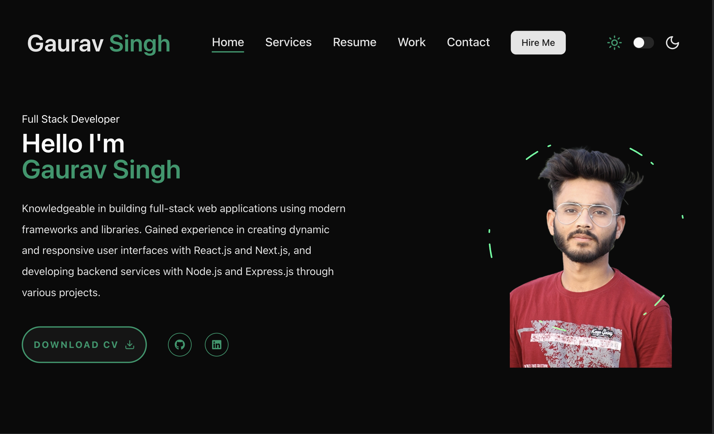

# 🚀 Personal Portfolio – Next.js + TypeScript + Tailwind CSS

This is my personal developer portfolio built with **Next.js App Router**, **TypeScript**, and **Tailwind CSS**. It uses modern UI libraries and animation frameworks to deliver a clean, responsive, and performant user experience.

## 🛠 Tech Stack

- **Framework**: [Next.js](https://nextjs.org/) (App Router)
- **Language**: [TypeScript](https://www.typescriptlang.org/)
- **Styling**: [Tailwind CSS](https://tailwindcss.com/)
- **UI Components**: [shadcn/ui](https://ui.shadcn.com/)
- **Theming**: [next-themes](https://github.com/pacocoursey/next-themes) – Light/Dark mode support
- **Animations**: [Framer Motion](https://www.framer.com/motion/)

## ✨ Features

- 🌐 Fully responsive layout
- 🌙 Light/Dark theme toggle
- ⚡ Micro animations using Framer Motion
- 🎨 Prebuilt UI components with shadcn
- 🚀 Optimized for performance and accessibility
- 🔧 Easy to customize and extend

## 📁 Project Structure

```
/portfolio            → Portfolio Frontend
    /app              → Next.js App Router pages
    /components       → Reusable React components
    /lib              → Utility functions and helpers
    /public           → Static assets
    /styles           → Global and Tailwind styles
    /types            → TypeScript type definitions

````

## 📦 Getting Started

### 1. Clone the Repository

```bash
git clone https://github.com/gmahur7/my-portfolio.git
cd /my-portfolio/portfolio
````

### 2. Install Dependencies

```bash
npm install
# or
yarn install
```

### 3. Run the Dev Server

```bash
npm run dev
# or
yarn dev
```

Visit `http://localhost:3000` to view the site locally.

## 📸 Preview



> Make sure to place a screenshot as `public/assets/images/preview.png` for visual preview in GitHub.

## 🧪 Scripts

| Command          | Description                |
| ---------------- | -------------------------- |
| `npm run dev`    | Start local dev server     |
| `npm run build`  | Build for production       |
| `npm run start`  | Start production server    |
| `npm run lint`   | Run linter                 |
| `npm run format` | Format code using Prettier |

## 🌍 Live Site

[🔗 https://your-portfolio-url.vercel.app](https://your-portfolio-url.vercel.app)

## 🧑‍💻 Author

**GAURAV SINGH**

* 🌐 [Portfolio](https://your-portfolio-url.vercel.app)
* 📧 [your-email@example.com](mailto:gm7017308@gmail.com)
* 💼 [LinkedIn](https://www.linkedin.com/in/gaurav-mahur-sept18)
* 🐙 [GitHub](https://github.com/gmahur7)

## 📄 License

This project is licensed under the [MIT License](LICENSE).

---

> Designed and developed with ❤️ using modern technologies.
